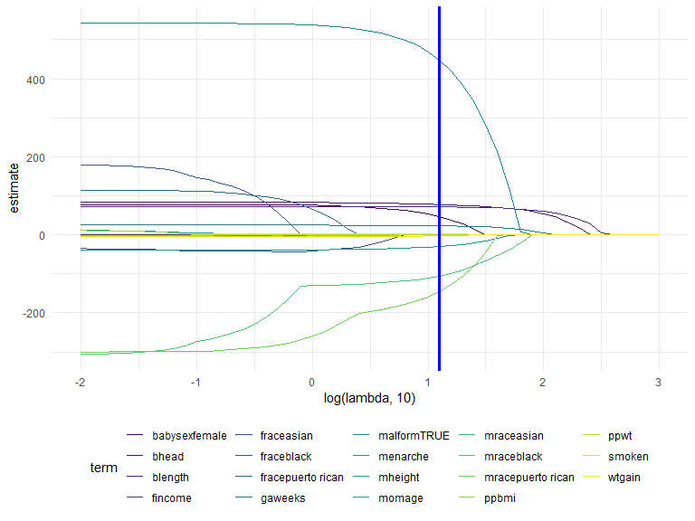
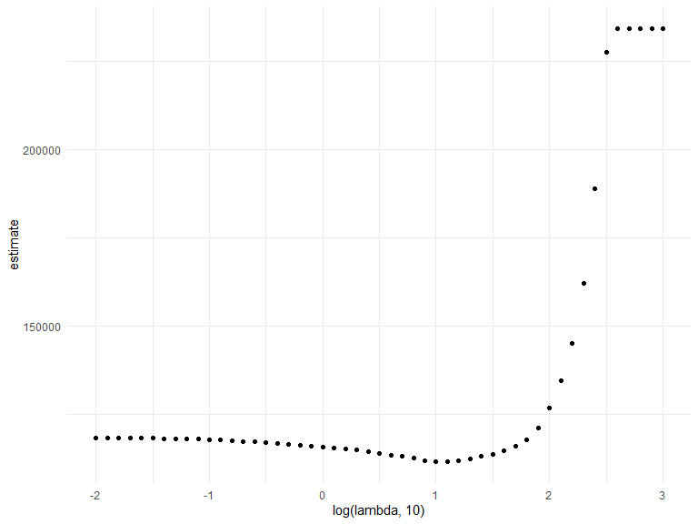
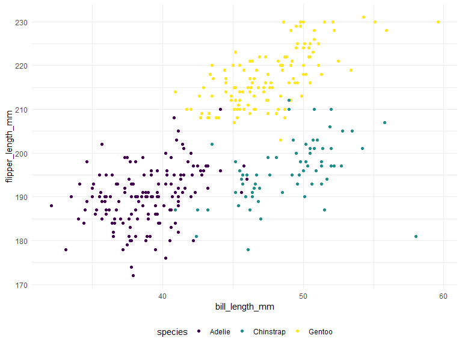

Lasso and Clustering
================

``` r
library(tidyverse)
```

    ## ── Attaching core tidyverse packages ──────────────────────── tidyverse 2.0.0 ──
    ## ✔ dplyr     1.1.3     ✔ readr     2.1.4
    ## ✔ forcats   1.0.0     ✔ stringr   1.5.0
    ## ✔ ggplot2   3.4.3     ✔ tibble    3.2.1
    ## ✔ lubridate 1.9.2     ✔ tidyr     1.3.0
    ## ✔ purrr     1.0.2     
    ## ── Conflicts ────────────────────────────────────────── tidyverse_conflicts() ──
    ## ✖ dplyr::filter() masks stats::filter()
    ## ✖ dplyr::lag()    masks stats::lag()
    ## ℹ Use the conflicted package (<http://conflicted.r-lib.org/>) to force all conflicts to become errors

``` r
library(glmnet)
```

    ## Loading required package: Matrix
    ## 
    ## Attaching package: 'Matrix'
    ## 
    ## The following objects are masked from 'package:tidyr':
    ## 
    ##     expand, pack, unpack
    ## 
    ## Loaded glmnet 4.1-8

``` r
knitr::opts_chunk$set(
    echo = TRUE,
    warning = FALSE,
    fig.width = 8, 
  fig.height = 6,
  out.width = "90%"
)

theme_set(theme_minimal() + theme(legend.position = "bottom"))

options(
  ggplot2.continuous.colour = "viridis",
  ggplot2.continuous.fill = "viridis"
)

scale_colour_discrete = scale_colour_viridis_d
scale_fill_discrete = scale_fill_viridis_d

set.seed(11)
```

## fit a lasso model using `glmnet`

let’s try to predict birthweight given the variables that we have…

``` r
bwt_df = 
  read_csv("data/birthweight.csv") |> 
  janitor::clean_names() |>
  mutate(
    babysex = as.factor(babysex),
    babysex = fct_recode(babysex, "male" = "1", "female" = "2"),
    frace = as.factor(frace),
    frace = fct_recode(
      frace, "white" = "1", "black" = "2", "asian" = "3", 
      "puerto rican" = "4", "other" = "8"),
    malform = as.logical(malform),
    mrace = as.factor(mrace),
    mrace = fct_recode(
      mrace, "white" = "1", "black" = "2", "asian" = "3", 
      "puerto rican" = "4")) |> 
  sample_n(200)
```

    ## Rows: 4342 Columns: 20
    ## ── Column specification ────────────────────────────────────────────────────────
    ## Delimiter: ","
    ## dbl (20): babysex, bhead, blength, bwt, delwt, fincome, frace, gaweeks, malf...
    ## 
    ## ℹ Use `spec()` to retrieve the full column specification for this data.
    ## ℹ Specify the column types or set `show_col_types = FALSE` to quiet this message.

get predictors and outcome.

``` r
x = model.matrix(bwt ~ ., bwt_df)[,-1]

y = bwt_df |> pull(bwt)
```

now, let’s fit lasso! but first, define a lambda grid

``` r
lambda = 10^(seq(3, -2, -0.1))

lasso_fit =
  glmnet(x, y, lambda = lambda)

lasso_cv =
  cv.glmnet(x, y, lambda = lambda)

lambda_opt = lasso_cv$lambda.min

log(lambda_opt, 10)
```

    ## [1] 1.1

let’s look at lasso results!

use `filter(step == __)` to filter the lasso results by most important.
what predictors show up at which step?

``` r
lasso_fit |> 
  broom::tidy() |> 
  filter(step == 20) |> 
  view()

lasso_fit |> 
  broom::tidy() |> 
  select(term, lambda, estimate) |> 
  complete(term, lambda, fill = list(estimate = 0) ) |> 
  filter(term != "(Intercept)") |> 
  ggplot(aes(x = log(lambda, 10), y = estimate, group = term, color = term)) + 
  geom_path() + 
  geom_vline(xintercept = log(lambda_opt, 10), color = "blue", size = 1.2)
```



show the CV results.

``` r
lasso_cv |> 
  broom::tidy() |> 
  ggplot(aes(x = log(lambda, 10), y = estimate)) + 
  geom_point()
```



## penguins!

``` r
library(palmerpenguins)

data("penguins")

penguins |> 
  ggplot(aes(x = bill_length_mm, y= flipper_length_mm, color = species)) +
  geom_point()
```



``` r
penguins = 
  penguins |> 
  select(species, bill_length_mm, flipper_length_mm) |> 
  drop_na()

kmeans_fit = 
  penguins |> 
  select(-species) |> 
  scale() |> 
  kmeans(centers = 3)

penguins |> 
  broom::augment(kmeans_fit, data = _) |> 
  ggplot(aes(x = bill_length_mm, y= flipper_length_mm, color = .cluster)) +
  geom_point(size = 3, alpha = 0.5)
```


